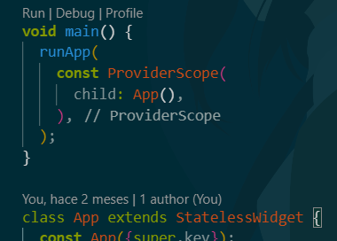

# Meals_app

Aplicación que permite visualizar algunas recetas y realizar filtros de recetas favoritas y categoria de ingredientes.

## Descarga e instalación.

Ejecutar los siguientes comandos.

Paso 1: Clonar el repositorio.

```nginx
git clone https://github.com/LuisFer27/meals_app.git

```

Paso 2 :Abrir visual studio code.


Paso 3 seleccionar la carpeta en donde se guardo el repositorio en la opción archivo y abrir carpeta.


se selecciona la carpeta en donde esta ubicado el repositorio ya que en este caso esta almacenado en documentos pero puede variar según el lugar en de lo tengas descargado.


Paso 4  una vez abierta la carpeta nos apareceran todas estas carpetas sin embargo la que nos interesa es la de lib en donde se alamcena todo los archivos dart para la ejecución de la aplicación.


Paso 5 abriremos la carpeta lib y nos dirigiremos al archivo main .dart.


abrimos el archivo main.dart y se nos visualizara de esta forma.

```dart
import 'package:flutter/material.dart';
import 'package:google_fonts/google_fonts.dart';
import 'package:flutter_riverpod/flutter_riverpod.dart';
//import 'package:meals_app/data/dummy_data.dart';
//import 'package:meals_app/screens/categories.dart';
import 'package:meals_app/screens/tabs.dart';

//import 'package:meals_app/screens/meals.dart';

final theme = ThemeData(
  useMaterial3: true,
  colorScheme: ColorScheme.fromSeed(
    brightness: Brightness.dark,
    seedColor: const Color.fromARGB(255, 131, 57, 0),
  ),
  textTheme: GoogleFonts.latoTextTheme(),
);

void main() {
  runApp(
    const ProviderScope(
      child: App(),
    ),
  );
}

class App extends StatelessWidget {
  const App({super.key});

  @override
  Widget build(BuildContext context) {
    return MaterialApp(
      theme: theme,
      home: const TabsScreen(),
    );
  }
}

```

en este caso en el editor le daremos click en run.



depende del dispositivo que dispongamos este se ejecutar si no podemos cambiarlo abajo de nuestro editor .


y escoger nuestro dispositivo principalmente movil ya que en este caso podemos seleccionar movil o virtual como en este ejemplo.


## Funcionalidad.

Pantalla principal se visualizan las categorias mediante colores para identificar las recetas de forma más sencilla au nque se pude reemplazar por imagenes relacionadas a las categorias ya que se puede adaptar.


Botones

Botón menú: en este se abre una lista desplegable para los filtros que se pueden aplicar y regresar a la pantalla dashboard que son meals y filters.


Filters permite ir a la siguiente pantalla .


Aqui se encuentran los filtros que se aplicaran esto afecta a todas las categorias que son los siguientes .

Gluten-free: mostrara la comida libre de gluten.

Lactose-free: mostrara la comida libre de lactosa .

Vegetarian: solo mostrara la comida vegetarana.

Vegan: solo mostrara comida vegana esto no incluye comida vegetariana que lleve ingredientes precederos.

Botón atras: regresa a la pantalla de inicio.

Pantalla al seleccionar una categoria esta se muestra al seleccionar una ya que en ella se visualizara la lista de comidas disponibles en cada categoria para su preparación que esta conformada por una imagen tiempo de preparación que es el simbolo de reloj la maleta que es el nivel de dificultad y el simbolo de precio que es en que economico o elevado en precio es hacer el platillo.


Al seleccionar la imagen se puede visualizar más la información de dicho platillo que son los ingredientes y pasos que lleva incluyendo la imagen al igual se habilita el bóton en forma de estrella que es para guardarlo en mis favoritos mediante un almacenado que se realiza en riverpod que esta en la carpeta providers.


al presionar la estrella antes mencionada este se guardara en mis favoritos y aparecer un mensaje que se guardo en mis favoritos ya que este se traducira en algún momento 


Ya que este se guardara en la página mis favoritos y se visualizara para futura referencia


